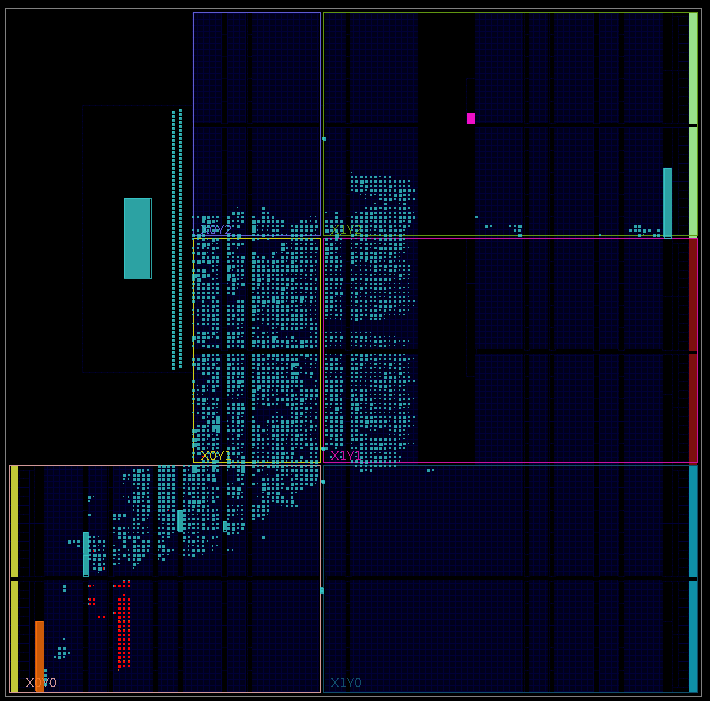

# Tunable-TDC

This repository contains an implementaiton of our Tunable Dual-Polarity Time-to-Digital Converter, a design containing only this sensor for the Pynq-Z1/Z2, and an example of this sensor co-located with a computation. This repository contains a flow for building a bitstream for both designs that rely on Vivado 2018.2. The steps for building the designs and final output product are as follows:

## Base
This design contains only the sensor itself, and can be used for reasoning about the behavior of the sensor in exclusion. The build files for this design can be located in:
```
burn/z1/base
```
Once in this directory, with Vivado 2018.2 properly sourced, the bitstream and tcl file can be built with:
```
make
```
This already will source the correct placement directives for the TDC, and this can be seen in the final floor plan:


The sensor carry chain is colored...

## PicoRV
This design contains our sensor co-located with a [PicoRV](https://github.com/YosysHQ/picorv32) core running a program of our choice. This design is located in:
```
burn/z1/picorv
```
Once in this directory, with Vivado 2018.2 properly sourced, the bitstream and tcl file can be built with:
```
make
```
This already will source the correct placement directives for the TDC, and this can be seen in the final floor plan:


The sensor carry chain is colored ... with the processor colored ...

## Package Installation
Integrated in the repository is a package for interfacing with the sensor architecture, as well as running arbitrary code on the PicoRV processor. This depends on a Pynq 2.5 or earlier installation of Pynq. This package can be installed from the top level directory with:
```
python3 -m pip install .
```
